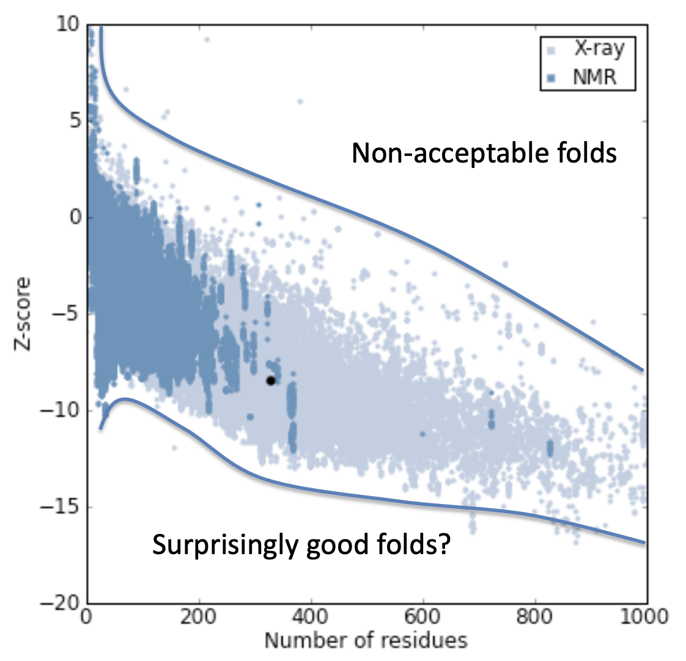

# Structural_Bioinformatics
This repository contains projects relating protein structure prediction using current bioinformatical techniques.

<ins>Index:</ins>
1. **Comparative Homology Modeling**
2. **Macro-complex Modeling and Restrictions**
3. **Loop Modeling, Refinement, and Assessment**
4. **Protein Structure Quality Assessment using Prosa**
5. **Threading**

<hr>

### 1. Comparative Homology Modeling
The frist step is to create a model by comparing the target sequence to the structure of its homologs.
1) Blast Search for Homologs (Templates)
2) Homolog selection\
   *From the Blast results select the homologs with the highest E-value. Do not select too many homologs as this will affect the modeller. In this example 3 homologs are used.*
3) Split Homologs into Chains\
   *If the target does not contain certain chains they can be omitted entirely.*
4) Prepare an Alignment File and Run Clustal Omgega
5) Convert the Alignment (.aln file) into PIR format
6) Run Modeller using Python
   ```bash
   modpy.sh python3 modeling1.py
   ```
8) Visualise using Chimera
9) Adjust the Alignment and Repeat Steps 6 and 7\
   *change alnfile parameter to the new alignment and increment a.starting_model and a.ending_model.*

<hr>

### 2. Macro-complex Modeling and Restrictions
How to model a protein complex (i.e., a protein with more than one chain).

1) Modify the PIR file\
   (alignment.pir) Place a "\" at the end of a chain and inculde start and end of each chain in the first line as such:
   ```
   >P1;1mee
    structureX:1mee:  1 :A:401  :C:  : : -1.00 :-1.00
    ISNNMDVINMSLGGPTGSTALKTVVDKAVSSGIVVAAAAGNEGSSGS-TSTVGYPAKYPS-/
    LKSFPEVVGKTVDQAREYFTLHYPQYNVYFLPEGSPVTLDLRYNRVRVFYNPGTNVVNHVPHVG*
   ```
   Start and end of each chain can be found in the PDB file. Save as a separate alignment file.
2) Run Modeller using python\
   Specify the new alignment file and increment a.starting_model and a.ending_model if needed.
3) Visualise using Chimera\
   Inspect the model and template superimposed to identify faulty regions
4) Modify the Python Script *(modeling2.py)*\
   Create a new class that inherits from automodel and add special restraints as such:
   ```python
   def special_restraints(self, aln):
        rsr = self.restraints
        at = self.atom
        rsr.add(secondary_structure.alpha(self.residue_range('251:A', '271:A')))
   ```
   Use the new MyModel class instead of automodel. Run.
5) Inspect again using Chimera
   Sometimes when forcing a helix the programme can place it in the wrong configuration

<hr>

### 3. Loop Modeling, Refinement, and Assessment
How to deal with non-regular structures between two regular secondary structures and variable regions. *Ab initio* modeling.

1) Modify the Python Script to Run loopmodel instead of automodel
2) Add Model and Loop Assessment Method (DOPE)\
   The programme can be run faster by adding:
   ```python
    a.md_level = refine.fast
    a.loop.md_level = refine.fast
   ```
   Run using
   ```bash
   modpy.sh python3 modeling3.py > modeling_11_12.log &
   ```
3) Introduce Special Restraints by Defining a MyModel Class\
   *(modeling3_1.py)*\
   Increment starting_model and ending_model.\
   For better models execute:
   ```python
    a.md_level = refine.slow
    a.loop.md_level = refine.slow
   ```
   Run using
   ```bash
   modpy.sh python3 modeling3.py > modeling_13_14.log &
   ```
4) Inspect the Results (modeling_13_14.log) to Find the Model with the <ins>Lowest</ins> DOPE Score (Best Model)\
   *DOPE is calculating the energy, so the lower the score the better.*

**See https://salilab.org/modeller/manual/ for more information.**

<hr>

### 4. Protein Structure Quality Assessment using Prosa
By analysing protein structure databases we can determine the probability of two residues being in close proximity. The frequency of two residues in close contact can be interpreted as probability and, hence, the inverse of Boltzmann's law can be applied to calculate energies.\
Prosa is a programme that allows us to score protein structures by their energies.\
**NB. This appraoch is only valid for soluable globular proteins.**

#### 4.1 Prosa Fundamentals

Run Prosa from the command line and use the Prosa console to execute commands.
```
execute session1.cmd
```
*The following cmd files have been obtained form the Prosa manual, see the [manual](prosa/Manual_prosa2003.pdf)*

**session1.cmd:** Read PDB Files and Calculate and Visualise the Energies\
```
read pdb pdb_file.ent obj1  # obj1 is the object name
winsize obj1 50  # smooth out the graph by taking the average in a window size of 50 residues
draw * obj1 1    # draw all energies for obj1
draw * * 0       # clear the graph
draw pair * 1    # for comparing pair energies of two objects

# Energies:
# pair: amino acid contacts
# surf: contact with solvent
# comb: pair + β surf

export plot myplot  # creates a myplot.ps file
```
```bash
ps2pdf myplot.ps    # converts ps file to a pdf graph
```
**session2.cmd:** Compare Energies\
**session4a.cmd:** Shift Graph to Compare Sequences of Different Lengths\
```
shift obj1 3  # shifts obj1 by 3 residues
```
**session4b.cmd:** Calculate Z-Scores\
```
zscore obj1 z-results  # creates a z-results.slp file
```
Z-scores relate to the protein sequence length as such:\
\
**session5.cmd:** Use Cα and Cβ Potentials\
```
# Load Potentials:
pair potential $PROSA_BASE/pII3.0.pair-cb pcb
surface potential $PROSA_BASE/pII3.0.surf-cb scb
pair potential $PROSA_BASE/pII3.0.pair-ca pca
surface potential $PROSA_BASE/pII3.0.surf-ca sca

# Specify which potentials to use:
use potential aat pca sca pcb scb
use potential spa pca sca pcb scb
```
**session6.cmd:** Use Only Cα Potentials\
**session7.cmd:** Analyse Mutant Structures without Generating New Models\
```
# Substitute amino acids:
mutate sequence wt 46 P mutant1
mutate sequence wt 5 E mutant2
mutate sequence mutant2 32 P mutant3
mutate sequence mutant3 47 L mutant4
```
NB. A lower peak for the mutant indicates a <ins>stabilising mutation.</ins>


**session8.cmd:** Compare Stability of Protein Regions using Mutability\

#### 4.2 Prosa Evaluation and Model Optimisation
Prosa can be used to calculate energy profiles of structure models. For instance, Prosa can help identify peaks of energy, in which case a model will have to be modified.\
To understand why peaks of energy occur in the model, we must first analyse the secondary structure. This can be done in DSSP, a program that calculates the hydrogen bonds. We can then use Psi-pred, a deep learning-base programme for predicting secondary structure based on the sequence of the protein, to predict *ab initio* the secondary structure. The prediction from Psi-pred will act as a guide for determining the adjustments that can be made to our model in regions that display high peaks of energy in Prosa.

1) Run Prosa
   ```
   execute 4_2_Prosa_Evaluation.cm
   ```
   Ensure that the alignment is correct. If needed, add:
   ```
   shift * 18
   shift mdlXX -18
   ```
2) Run DSSP to create a model.dssp file
   ```
   dssp P11018.BL0000XX.pdb model.dssp
   ```
3) Create a secondary structure prediction with Psi-pred. This will output two files: P11018.ss2 and P11018.horiz
   ```
   psipred P11018.fa
   psipred.pl P11018.ss2 > psipred.pir
   aliss.pl model.dssp > dssp.pir
   cat psipred.pir > compare.pir
   cat dssp.pir >> compare.pir
   aconvertMod2.pl -in p -out c < compare.pir > compare.aln
   ```
   The resulting compare.aln file will show an aligment file. The P11018.horiz file can be used as reference for the reliability of the prediction (Conf row; 0-9 score corresponding to 0-90% confidence).
4) Refer back to Prosa to identify the locations of peaks.\
   Check the compare.aln file within the specified residue range to check where the models differ. Psi-pred can be trusted if high confidence is indicated in the P11018.horiz file.
5) Adjust the alignment.aln file and convert to pir format
6) Run Modeller to create a new model based on the modify alignment
7) Visualise in Prosa\
   Keep other model objects in order to compare the graphs.
8) Rank the models based on the Z-score. In Prosa:
   ```
   init zscore
   zscore * z-results
   ```

### 5. Threading
Threading is an approach for *ab initio* protein structure prediction. Due to the large computational cost of threading, this approach may not be feasible for most personal machines. The programme THREADER can be used for this method.\
Threader input can be either the protein sequence or its secondary structure. To run threader with secondary structure we need the .horitz file, which can be generated using Psi-pred (as seen in section 4.2).\
Other online server-based programmes include PHYRE, iTASSER, and MODLINK, however, these take a long time to run (often ~24 hours).

<ins>Threader step-by-step:</ins>
1) Create the mylist.lst restriction list file by searching the $THREADER_DIR for similar protein structures (e.g., proteinases but not proteinase inhibitors)
   ```bash
   grep PROTEINASE $THREADER_DIR/tbd/* | fgrep -v INHIBITOR | cut -d " " -f 2 > mylist.lst
   ```
   mylist.lst will contain the codes of the proteins for running Threader
2) Run Threader
   ```bash
    threader -pm -v -j TARGET.horiz results.ssout mylist.lst >& results.sslog
    # TARGET.horiz can be substituted with TARGET.fasta
    # mylist.lst is a list of restrictions
    # results.ssout will contain the ranking of the best folds
    ```
3) Evaluate Threader results
   ```bash
    $THREADER_DIR/texp/texp -s $THREADER_DIR/texp/weights.dat results.ssout | sort -n -r > results.texp
    ```
4) Obtain the .ent file for the best ranked template and use it to generate a PIR alignment file with the target (threader.pir)
5) Run Modeller 
   ```bash
   modpy.sh python modeling5_Threader.py > modeling_threader.log
   ```
6) Analyse using Prosa
   
   
   


